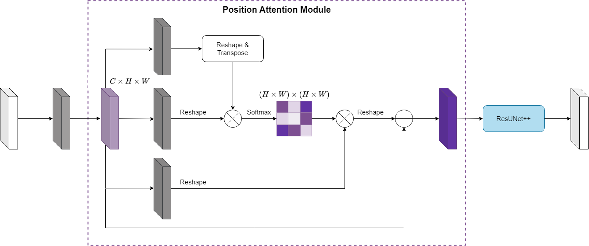
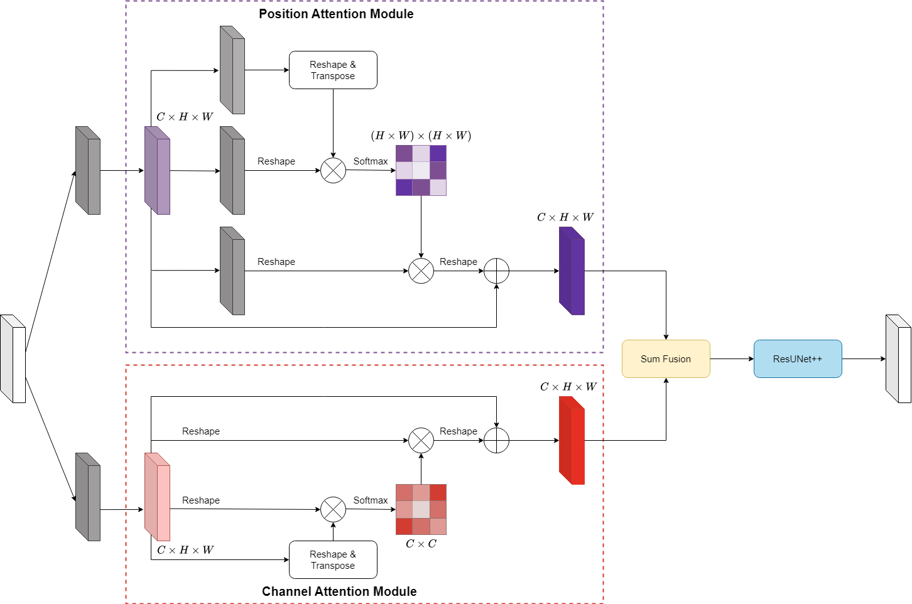
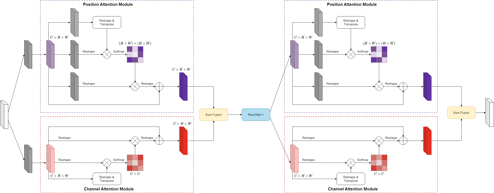

# Advancing precision in endoscopic surgery: a novel approach with attention mechanisms and adaptive threshold for surgical instrument segmentation

## Proposed architectures

### PAM-ResUNet++

### DA-ResUNet++

### DoubleDA-ResUNet++

## Datasets:

- **Kvasir Instrument**:
  - Website to the original dataset: https://datasets.simula.no/kvasir-instrument
- **Rigid Instruments**:
  - Website to the original dataset: https://opencas.webarchiv.kit.edu/?q=node/30
- **Endoscopic** :
  - Website to the original dataset: https://opencas.webarchiv.kit.edu/?q=InstrumentCrowd

## Benchmark

### Comparison with other methods on Kvasir Instrument dataset

|      Method       | Dice  |   IoU   |
| :---------------: | :---: | :-----: |
|       U-Net       | 0.908 |  0.863  |
|    Deeplabv3+     | 0.907 |  0.863  |
|     TerausNet     | 0.916 |  0.853  |
|  Attention U-Net  | 0.926 |  0.891  |
|      U-Net++      | 0.927 |  0.892  |
|    DoubleUNet     | 0.903 |  0.843  |
|      RASNet       | 0.954 |  0.925  |
|      NanoNet      | 0.928 |  0.879  |
|     MSRF-Net      | 0.937 |  0.899  |
|      PAANet       | 0.949 |  0.916  |
|     Swin-UNet     | 0.919 | 0.0.858 |
|     SurgiNet      | 0.949 |  0.917  |
|      FAT-Net      | 0.956 |  0.928  |
| Attention SurgNet | 0.957 |  0.921  |
|     MSDE-Net      | 0.972 |  0.950  |
|     **Ours**      | 0.975 |  0.930  |

### Comparison with other methods on Rigid Instruments dataset

|     Method      | Dice  |  IoU  |
| :-------------: | :---: | :---: |
|     FCN-32s     | 0.716 | 0.558 |
|     FCN-16s     | 0.822 | 0.698 |
|     FCN-8s      | 0.788 | 0.510 |
|     PSPNet      | 0.606 | 0.435 |
|    DeepLabv3    | 0.665 | 0.498 |
|      M-Net      | 0.772 | 0.670 |
| Attention U-Net | 0.813 | 0.686 |
|    M-Net 51     | 0.871 | 0.771 |
|   U-Net + DFP   | 0.899 | 0.817 |
|    **Ours**     | 0.914 | 0.848 |

### Comparison on models' complexity

|            Method             | Parameters (MB) |
| :---------------------------: | :-------------: |
|             U-Net             |     335.29      |
|            ResUNet            |      4.02       |
|        Attention U-Net        |     415.25      |
|            U-Net++            |     213.80      |
|           ResUNet++           |      15.53      |
|           Swin-UNet           |      23.74      |
|            FAT-Net            |     342.51      |
|           MSDE-Net            |     324.59      |
|   **PAM-ResUNet++ (ours)**    |      15.54      |
|    **DA-ResUNet++ (ours)**    |      15.61      |
| **DoubleDA-ResUNet++ (ours)** |      15.65      |
